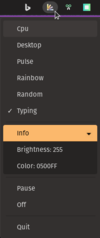

# huekeys

<p align="center">
  <a href="https://goreportcard.com/report/github.com/BitPonyLLC/huekeys">
    
  </a>
  <a href="https://godoc.org/github.com/BitPonyLLC/huekeys">
    
  </a>
  <a href="LICENSE">
    
  </a>
  <a href="https://github.com/BitPonyLLC/huekeys/releases/latest">
    
  </a>
</p>

---

Huekeys is a fun application that makes it easy to adjust your System76 keyboard colors and brightness. In addition to the simple ability to set and get the color and brightness, it also provides several patterns that you can run indefinitely, to really make your keyboard pop!

<p align="center">
  
</p>

- Change the color according to CPU utilization (cold to hot).
- Monitor the desktop picture and change the keyboard color to match.
- Pulse the keyboard brightness up and down.
- Loop through all the colors of the rainbow.
- Constantly change the color to a random selection.
- Change the color according to typing speed (cold to hot)
  - Optionally switch to another pattern while typing has stopped for a while!
- And best of all, manage it from a convenient system tray interface!

  

### Questions?

If you have any questions, please hop into our [Discord!](https://discord.gg/remmt4cx27)

### Installation

Choose one of the following that works best for you:

- Using [Homebrew on Linux](https://docs.brew.sh/Homebrew-on-Linux):
  ```sh
  $ brew install bitponyllc/tap/huekeys
  ```
- Using [GitHub CLI](https://cli.github.com/):
  ```sh
  $ gh release download -R BitPonyLLC/huekeys -p huekeys
  ```
- Download from [the Releases page](https://github.com/BitPonyLLC/huekeys/releases/latest)

After installation, note the following:
- If you did *NOT* use Homebrew, you *may* need to install a library:
  - If you see this error…
    ```
    error while loading shared libraries: libayatana-appindicator3.so.1: cannot open shared object file: No such file or directory
    ```
    …then run this:
    ```sh
    $ sudo apt install libayatana-appindicator3-1
    ```
- The device access `huekeys` uses to change the keyboard color, brightness, or to monitor typing, all require root privileges. As such, you must either run with `sudo` or modify the permissions of the devices.
  - If you want to modify the device permissions, you can do something like the following (depending on your own setup), but **TAKE NOTE** that it will not survive a reboot (the permissions will revert to root-only):
    ```sh
    $ ( cd /sys/class/leds/system76*\:\:kbd_backlight && \
        sudo chgrp adm color* brightness && \
        sudo chmod 664 brightness color* )
    ```

### Usage

```sh
# show the basic help
$ huekeys

# set color to red
$ huekeys set red

# set brightness
$ huekeys set 255

# set color and brightness
$ huekeys set pink 127

# run an infinite rainbow in the background
$ huekeys run rainbow &

# run an infinite pulse in the background
$ huekeys run pulse &

# my personal favorite, make the colors get warmer the faster you type,
# but synchronize with the desktop background when idle!
$ huekeys run typing -i desktop
```

### Menu

To show a system tray icon for controlling the current color pattern from the desktop:

```sh
$ huekeys menu
```

Unless there's already another `huekeys` "wait" process already running, you will be prompted for your `sudo` password to run a background process that will listen for commands from the menu app. Once running, simply choose the pattern you'd like to have running!

Optionally, you can also open the *Info* section to see the currently set color and brightness values. Clicking on them will copy those values into your clipboard in case you'd like to use or remember a specific setting for later.

To temporarily stop a pattern, select the *Pause* item, or, to completely turn the keyboard lights off, select *Off*.

### Remote Control

When there's a background "wait" process running, you can use `huekeys` to coordinate changes from the command line, too. For example, when running `get` you'll note that, in addition to telling you about the current color and brightness values, it also indicates what current color pattern is running. Likewise, most commands will coordinate with the background process, allowing you to use `huekeys run` to change the current pattern, or even `huekeys quit` to stop the background process.

### Configuration

Most of the command line options can be managed through a configuration file. To begin, have the defaults dumped out and saved into your home directory:

```sh
$ huekeys --dump-config > ~/.huekeys
```

Feel free to change the values to better suit your preferences.

NOTE: The configuration file is monitored and when changed, most values will be adjusted in any live running process (e.g. you can change the log level without restarting the process).

|       Global&nbsp;Key       |       Default       | Acceptable Values                                                                                                                          | Description                                                                                                                  |
| :-------------------------: | :-----------------: | :----------------------------------------------------------------------------------------------------------------------------------------- | :--------------------------------------------------------------------------------------------------------------------------- |
| <code>log&#x2011;dst</code> |      'syslog'       | <ul><li>'syslog'</li><li>'stdout'</li><li>'stderr'</li><li>'/path/to/file.log'</li></ul>                                                   | Indicate where logs should be written.                                                                                       |
| <code>log&#x2011;lvl</code> |       'info'        | <ul><li>'trace'</li><li>'debug'</li><li>'info'</li><li>'warn'</li><li>'error'</li><li>'fatal'</li><li>'panic'</li><li>'disabled'</li></ul> | Indicate level of logging.                                                                                                   |
|           `nice`            |         10          | -20 to 19                                                                                                                                  | Run with an adjusted priority, values range from -20 (most favorable to the process) to 19 (least favorable to the process). |
|          `pidpath`          | '/tmp/huekeys.pid'  | '/path/to/file.pid'                                                                                                                        | Indicate where to store the process ID (needed for menu to communicate with background process).                             |
|         `sockpath`          | '/tmp/huekeys.sock' | '/path/to/file.sock'                                                                                                                       | Indicate where to create the socket file (needed for menu to communicate with background process).                           |

| Menu&nbsp;Key | Default | Acceptable Values                    | Description                                              |
| :-----------: | :-----: | :----------------------------------- | :------------------------------------------------------- |
|   `pattern`   |   ''    | Any pattern name (see `huekeys run`) | Indicate the pattern to begin when the menu is launched. |

| CPU&nbsp;Key | Default | Acceptable Values                                                           | Description                                                                           |
| :----------: | :-----: | :-------------------------------------------------------------------------- | :------------------------------------------------------------------------------------ |
|   `delay`    |  '1s'   | Anything accepted by [ParseDuration](https://pkg.go.dev/time#ParseDuration) | Indicate how long to wait between color updates based on the current CPU utilization. |

| Pulse&nbsp;Key | Default | Acceptable Values                                                           | Description                                                                 |
| :------------: | :-----: | :-------------------------------------------------------------------------- | :-------------------------------------------------------------------------- |
|    `delay`     | '25ms'  | Anything accepted by [ParseDuration](https://pkg.go.dev/time#ParseDuration) | Indicate how long to wait between color updates of the keyboard brightness. |

| Rainbow&nbsp;Key | Default | Acceptable Values                                                           | Description                                      |
| :--------------: | :-----: | :-------------------------------------------------------------------------- | :----------------------------------------------- |
|     `delay`      |  '1ms'  | Anything accepted by [ParseDuration](https://pkg.go.dev/time#ParseDuration) | Indicate how long to wait between color updates. |

| Random&nbsp;Key | Default | Acceptable Values                                                           | Description                                      |
| :-------------: | :-----: | :-------------------------------------------------------------------------- | :----------------------------------------------- |
|     `delay`     |  '1s'   | Anything accepted by [ParseDuration](https://pkg.go.dev/time#ParseDuration) | Indicate how long to wait between color updates. |

|              Typing&nbsp;Key              | Default | Acceptable Values                                                           | Description                                                                                                                                   |
| :---------------------------------------: | :-----: | :-------------------------------------------------------------------------- | :-------------------------------------------------------------------------------------------------------------------------------------------- |
|                  `delay`                  | '300ms' | Anything accepted by [ParseDuration](https://pkg.go.dev/time#ParseDuration) | Indicate how long to wait between color updates based on the rate (and type) of keys being pressed.                                           |
|                `all-keys`                 |  false  | <ul><li>true</li><li>false</li></ul>                                        | Indicate if typing should monitor any keypress (default is to watch only "printable" characters and ignore "control" keypresses).             |
|                  `idle`                   |   ''    | Any pattern name (see `huekeys run`)                                        | Indicate the pattern to begin when keys have not been pressed for the configured `idle-period`.                                               |
|      <code>idle&#x2011;period</code>      |  '30s'  | Anything accepted by [ParseDuration](https://pkg.go.dev/time#ParseDuration) | Indicate the amount of time to wait between the last key press and when the `idle` pattern is started.                                        |
| <code>input&#x2011;event&#x2011;id</code> |   ''    |                                                                             | Indicate which input device to use for monitoring the keystrokes (default is to find the first keyboard listed in `/proc/bus/input/devices`). |

## Attribution

This project was originally produced as https://github.com/bambash/sys76-kb. Though it's significantly different as `huekeys`, a huge thanks goes out to bambash's original as an excellent starting point!
